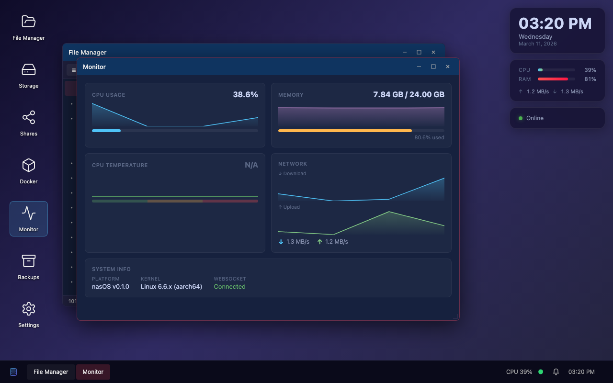
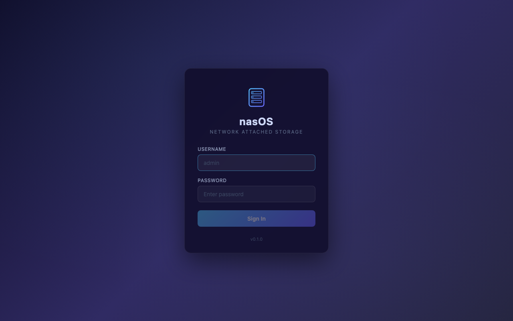
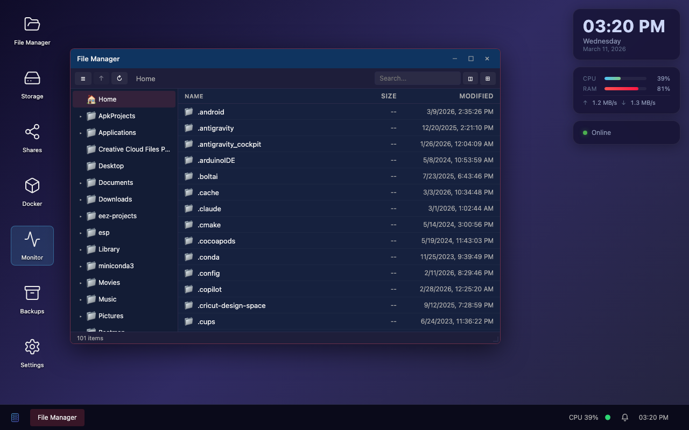
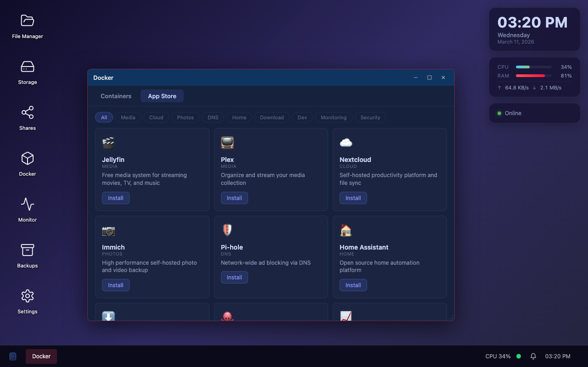
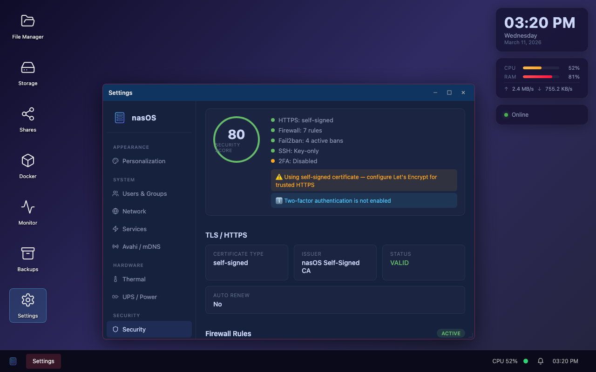
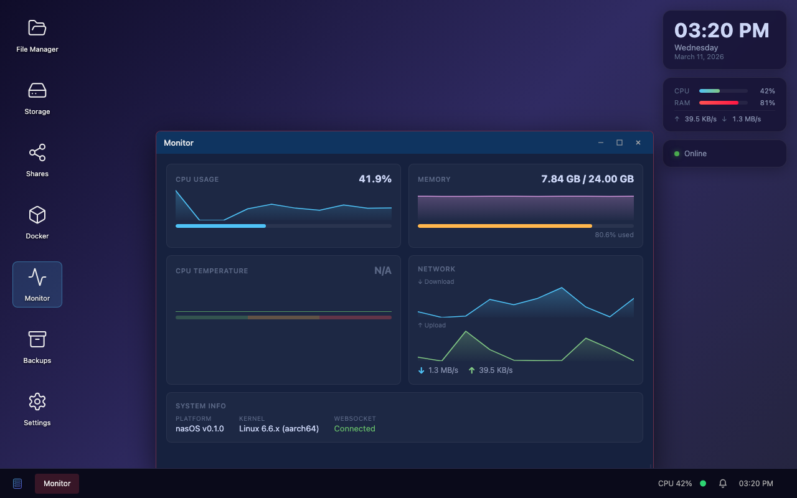

<p align="center">
  
</p>

<h1 align="center">nasOS</h1>

<p align="center">
  A NAS management platform for Raspberry Pi 5 — boots into a desktop environment<br>
  on a connected display and is accessible remotely from any web browser.
</p>

<p align="center">
  
  
  
  
  
  
</p>

---

<p align="center">
  
</p>

## What is nasOS?

nasOS is a NAS management platform that turns a Raspberry Pi 5 into a full-featured network-attached storage device. It runs on top of Raspberry Pi OS Lite (Debian Bookworm) — the same way Synology DSM runs on Linux, or UGOS Pro runs on Linux. nasOS is the management layer: the interface, the API, and the tooling that makes the Pi behave like a dedicated NAS appliance.

Unlike headless NAS solutions, nasOS boots directly into a graphical desktop on an attached display — the same interface you see in the browser when you connect remotely.

The desktop is a custom window manager built entirely in React with draggable, resizable, snappable windows, a taskbar, system tray, notifications, and keyboard shortcuts like Alt+Tab. Every management task — files, storage, shares, Docker containers, backups, users, network, security — has its own windowed application.

The backend is a FastAPI server that wraps real Linux system tools (`lsblk`, `smartctl`, `smbpasswd`, `docker`, `systemctl`, etc.) behind a REST + WebSocket API. On macOS/Windows dev machines the backend automatically returns mock data, so every feature of the UI can be developed and tested without a Pi.

## Live Demo
View and explore a live demo [here](https://rttgnck.github.io/nasOS)

## Features

### Desktop Environment
- **Window Manager** — drag, resize, snap-to-edge, minimize, maximize, quarter-tile, Alt+Tab cycling, window animations
- **Taskbar** — open window list, system clock, app launcher menu
- **System Tray** — real-time CPU/RAM/temperature indicators, online status, network throughput
- **Desktop Icons** — double-click to launch apps, right-click context menus
- **Toast Notifications** — real-time feedback on system actions

### File Management
- **Dual-pane File Manager** — tree sidebar, icon/list view, breadcrumb navigation
- **Drag & Drop** — between panes, between windows, to/from desktop
- **File Preview** — images, text, video, PDF rendered inline in a preview pane
- **Upload / Download** — browser-based file transfers with multi-file support
- **Search** — filename search across directories
- **Context Menus** — copy, cut, paste, rename, delete, compress, properties

### Storage & Shares
- **Disk Overview** — attached disks with partition maps, usage bars, health indicators
- **SMART Monitoring** — disk health scores (Good / Warning / Critical) from `smartctl`
- **Volume Management** — list and manage filesystem volumes
- **Share Wizard** — create SMB, NFS, or WebDAV shares with a step-by-step overlay
- **Permission Editor** — per-share user/group read/write access control

### Docker & App Store
- **Container Management** — list, start, stop, restart, and remove containers with integrated log viewing
- **One-Click App Store** — install Jellyfin, Plex, Nextcloud, Immich, Pi-hole, Home Assistant, and more from a curated catalog
- **Category Filters** — browse by Media, Cloud, Photos, DNS, Home, Download, Dev, Monitoring, Security

### Backup & Sync
- **Backup Jobs** — create scheduled rsync/rclone-based backup jobs with SQLite persistence
- **Btrfs Snapshots** — list and manage filesystem snapshots
- **Cloud Remotes** — configure S3, Backblaze B2, Google Drive, OneDrive, and Dropbox targets via rclone

### System & Security
- **System Monitor** — real-time sparkline graphs for CPU, memory, disk I/O, and network via WebSocket
- **Temperature Gauge** — CPU/GPU thermal monitoring with throttle detection
- **Security Score** — composite 0–100 rating covering TLS, 2FA, fail2ban, firewall, and SSH hardening
- **Log Viewer** — filterable journalctl viewer with priority coloring and unit filtering
- **User Management** — create/delete system users with automatic Samba password sync
- **Network Settings** — interface configuration, DNS, hostname, and service start/stop
- **Settings Panel (9 tabs)** — Users, Network, Services, Security, Thermal, UPS/NUT, Updates, Avahi/mDNS, Time Machine

## Screenshots

<table>
  <tr>
    <td align="center"><br><b>Login Screen</b></td>
    <td align="center"><br><b>File Manager</b></td>
  </tr>
  <tr>
    <td align="center"><br><b>Docker App Store</b></td>
    <td align="center"><br><b>Settings Panel</b></td>
  </tr>
  <tr>
    <td align="center"><br><b>System Monitor</b></td>
    <td align="center"><br><b>Desktop Overview</b></td>
  </tr>
</table>

## Architecture

```
┌───────────────────────────────────────────────────────┐
│                   Pi 5 Hardware                        │
├───────────────────────────────────────────────────────┤
│  Raspberry Pi OS Lite (Bookworm, 64-bit)              │
├───────────────────┬───────────────────────────────────┤
│  System Services  │      nasOS Backend (FastAPI)       │
│  ┌─────────────┐  │  ┌─────────────────────────────┐  │
│  │ samba       │  │  │  REST API + WebSocket        │  │
│  │ nfs-server  │  │  │  ├─ file management          │  │
│  │ docker      │  │  │  ├─ storage / SMART          │  │
│  │ avahi       │  │  │  ├─ share management         │  │
│  │ smartd      │  │  │  ├─ user / group mgmt        │  │
│  │ nut (UPS)   │  │  │  ├─ Docker management        │  │
│  │ fail2ban    │  │  │  ├─ backup / sync engine      │  │
│  │ cage (wlr)  │  │  │  ├─ security & system extras  │  │
│  └─────────────┘  │  │  └─ notification system       │  │
│                   │  └─────────────────────────────┘  │
├───────────────────┴───────────────────────────────────┤
│             nasOS Desktop UI (React + TS)              │
│  ┌─────────────────────────────────────────────────┐  │
│  │  Window Manager (custom JS engine)              │  │
│  │  ├─ File Manager     ├─ Docker / App Store      │  │
│  │  ├─ Storage Manager  ├─ Backup Manager          │  │
│  │  ├─ Share Manager    ├─ Log Viewer              │  │
│  │  ├─ System Monitor   ├─ Settings (9 tabs)       │  │
│  │  └─ User / Network                             │  │
│  ├─────────────────────────────────────────────────┤  │
│  │  Taskbar  │  System Tray  │  Notifications      │  │
│  └─────────────────────────────────────────────────┘  │
├───────────────────────────────────────────────────────┤
│  Electron (local display)  │  Browser (remote HTTPS)  │
└───────────────────────────────────────────────────────┘
```

## Tech Stack

| Layer | Technology |
|-------|-----------|
| Base OS | Raspberry Pi OS Lite (Bookworm, 64-bit) via pi-gen — nasOS runs on top of this |
| Backend | Python 3.11+ / FastAPI / uvicorn |
| Database | SQLite via SQLAlchemy (async) + aiosqlite |
| Frontend | React 18 + TypeScript 5.6 / Vite 6 / zustand 5 |
| UI Components | lucide-react, react-rnd |
| Local Display | Electron (kiosk via cage Wayland compositor) |
| Remote Access | Same React UI served over HTTPS |
| Real-time | WebSocket (system metrics, notifications) |
| Auth | JWT (OAuth2 password flow) + TOTP 2FA (pyotp) |
| Image Builder | Custom pi-gen stage, built via Docker |

## Quick Start (Development)

### Prerequisites

- Python 3.11+
- Node.js 20+
- npm

> A Python virtual environment is strongly recommended to avoid dependency conflicts.

### Install

```bash
git clone https://github.com/rttgnck/nasOS.git
cd nasOS

# Create and activate a virtual environment (recommended)
python3 -m venv .venv
source .venv/bin/activate   # Windows: .venv\Scripts\activate

make install
```

`make install` installs the Python backend in editable mode (with dev extras), the frontend npm packages, and the Electron npm packages.

### Run

```bash
make dev
```

This starts the FastAPI backend on port **8080** and the Vite dev server on port **5173**. Open **http://localhost:5173** in your browser and log in with:

| | |
|---|---|
| **Username** | `admin` |
| **Password** | `nasos` |

> On non-Linux systems the backend automatically returns mock data — every feature is fully usable for UI development without a Pi.

### Alternative: Docker Compose

If you prefer a containerised dev environment:

```bash
docker compose -f docker-compose.dev.yml up
```

This brings up the same backend (port 8080) and frontend (port 5173) with hot reload via volume mounts.

### Electron (Local Display)

With the dev servers already running:

```bash
make dev-electron
```

### Build for Production

```bash
make build
```

Compiles the TypeScript frontend and outputs static assets to `frontend/dist/`. The FastAPI backend serves these files in production.

### Run Tests

```bash
make test
```

Runs the `pytest` suite for the backend and `vitest` for the frontend.

Other useful targets:

```bash
make lint          # ruff (backend) + eslint (frontend)
make dev-backend   # FastAPI only (port 8080)
make dev-frontend  # Vite only (port 5173)
make clean         # remove build artefacts
```

## Deploy to Raspberry Pi 5

### Hardware

- Raspberry Pi 5 (4 GB or 8 GB recommended)
- microSD card (32 GB+) or NVMe SSD via HAT
- USB or SATA storage drives for NAS data
- HDMI display (optional — for local desktop)
- Ethernet recommended (Wi-Fi supported)

### Build the SD Card Image

The image builder wraps [pi-gen](https://github.com/RPi-Distro/pi-gen) in Docker to produce a flashable `.img.xz` for Raspberry Pi 5. **Docker must be installed and running.**

```bash
cd image-builder
./build.sh
```

**Options:**

| Flag | Description |
|------|-------------|
| `--skip-frontend` | Skip `npm run build` (use when the frontend is already built) |
| `--clean` | Remove the pi-gen cache and perform a clean build |

The finished image is written to `image-builder/deploy/`.

### Flash

Flash the image to your SD card with [Raspberry Pi Imager](https://www.raspberrypi.com/software/) or `dd`:

```bash
sudo dd if=image-builder/deploy/nasos.img of=/dev/sdX bs=4M status=progress
```

### First Boot

1. Insert the SD card and power on the Pi
2. nasOS runs a first-boot script that configures the hostname, generates SSH keys, and initialises the default admin user
3. The desktop appears on the HDMI display within about 30 seconds
4. From any device on the same network, open **https://nasos.local** in a browser

### Logging In

You can sign in with either of the following accounts:

| Account | Username | Password | Notes |
|---------|----------|----------|-------|
| **nasOS admin** | `admin` | `nasos` | Default nasOS management account |
| **Pi Imager user** | *(your chosen username)* | *(your chosen password)* | Set in Raspberry Pi Imager before flashing |

> **Using the Pi Imager user for file shares?** You must set a Samba password for that account before SMB/NFS shares will work. Go to **Settings → Users**, select the user, and set a share password.

### Remote Access

The full desktop UI is served over HTTPS at:

- `https://nasos.local` — via mDNS/Avahi (zero-config)
- `https://<pi-ip-address>` — by IP address

## Project Structure

```
nasOS/
├── backend/                    # FastAPI application
│   ├── app/
│   │   ├── main.py             # App entrypoint, CORS, routers
│   │   ├── api/                # Route handlers
│   │   │   ├── auth.py         # JWT login, session management
│   │   │   ├── files.py        # File browser (list, copy, move, upload, download)
│   │   │   ├── storage.py      # Disks, volumes, SMART health
│   │   │   ├── shares.py       # SMB / NFS / WebDAV share CRUD
│   │   │   ├── docker.py       # Container lifecycle + app catalog
│   │   │   ├── backup.py       # Backup jobs, snapshots, cloud remotes
│   │   │   ├── users.py        # User / group management
│   │   │   ├── network.py      # Interfaces, DNS, hostname, services
│   │   │   ├── security.py     # Security score, TLS, fail2ban, firewall
│   │   │   ├── extras.py       # Avahi, Time Machine, UPS, thermal, updates
│   │   │   ├── logs.py         # Journalctl log viewer
│   │   │   ├── update.py       # OTA update manager
│   │   │   └── system.py       # Health, info, metrics
│   │   ├── core/               # Config, database, JWT security
│   │   ├── models/             # SQLAlchemy models (shares, backups)
│   │   ├── services/           # Business logic layer
│   │   └── ws/                 # WebSocket handlers (real-time metrics)
│   ├── tests/                  # pytest suite
│   └── pyproject.toml          # Python project metadata & dependencies
│
├── frontend/                   # React desktop UI
│   ├── src/
│   │   ├── apps/               # Windowed applications
│   │   │   ├── FileManager/    # Dual-pane file browser
│   │   │   ├── StorageManager/ # Disk overview + SMART
│   │   │   ├── ShareManager/   # Share wizard + permissions
│   │   │   ├── DockerManager/  # Containers + App Store
│   │   │   ├── BackupManager/  # Jobs, snapshots, remotes
│   │   │   ├── SystemMonitor/  # Real-time sparkline dashboard
│   │   │   ├── LogViewer/      # Filterable system logs
│   │   │   ├── Settings/       # 9-tab control panel
│   │   │   └── LoginScreen/    # Authentication gate
│   │   ├── desktop/            # Window manager, taskbar, tray
│   │   ├── hooks/              # useApi, useWebSocket
│   │   ├── store/              # zustand stores (window, system, auth)
│   │   └── __tests__/          # vitest suite
│   └── public/                 # Logo, wallpapers, icons
│
├── electron/                   # Electron shell for local display
├── system/                     # systemd units, udev rules, shell scripts, configs
│   ├── configs/                # SMB, NFS, Avahi, WPA supplicant templates
│   ├── scripts/                # first-boot, apply-update, share-helper, etc.
│   ├── systemd/                # nasos-backend, nasos-electron, watchdog units
│   └── udev/                   # disk hotplug + USB backup rules
├── image-builder/              # pi-gen based SD card image builder
│   ├── build.sh                # Main build script (requires Docker)
│   ├── config                  # pi-gen configuration
│   └── stage-nasos/            # Custom pi-gen stage (00-04)
├── docs/                       # Screenshots and documentation assets
├── Makefile                    # dev, build, test, lint, install, clean targets
└── docker-compose.dev.yml      # Containerised dev environment
```

## API Reference

| Route | Method | Description |
|-------|--------|-------------|
| `/api/auth/login` | POST | Obtain a JWT token |
| `/api/auth/me` | GET | Current authenticated user |
| `/api/system/{health,info,metrics}` | GET | System health and live metrics |
| `/api/files/{list,tree,search,preview}` | GET | File browsing and search |
| `/api/files/{copy,move,delete,upload}` | POST | File operations |
| `/api/files/download` | GET | File download |
| `/api/storage/{overview,disks,volumes}` | GET | Storage overview |
| `/api/storage/disks/smart` | GET | SMART health data |
| `/api/shares` | GET/POST | List or create shares (SMB/NFS/WebDAV) |
| `/api/shares/{id}` | PUT/DELETE | Update or delete a share |
| `/api/users` | GET/POST | List or create system users |
| `/api/users/groups` | GET | List groups |
| `/api/network` | GET | Network interface info |
| `/api/network/services` | GET | System service status |
| `/api/docker/containers` | GET | List Docker containers |
| `/api/docker/containers/{id}/{action}` | POST | Start, stop, restart, remove |
| `/api/docker/catalog` | GET | App Store catalog |
| `/api/docker/install` | POST | Install an app from the catalog |
| `/api/backup/jobs` | GET/POST | Backup job management |
| `/api/backup/snapshots` | GET | Btrfs snapshot listing |
| `/api/backup/remotes` | GET | Cloud remote listing |
| `/api/security/overview` | GET | Security score and config |
| `/api/extras/{avahi,thermal,ups,...}` | GET | System extras |
| `/api/logs` | GET | Filtered system logs |
| `/ws/metrics` | WS | Real-time system metrics stream |

The interactive API docs are available at **http://localhost:8080/docs** when the backend is running.

## About

nasOS was designed and built with the assistance of [Claude](https://claude.ai) (Anthropic). As a result, there may be bugs, rough edges, or areas that need improvement. If you find something broken, a pull request is the best way to fix it — all bug fix PRs will be reviewed and merged.

## Contributing

Contributions are welcome for personal and non-commercial use. Please read the [LICENSE](LICENSE) before contributing.

Bug fixes in particular are encouraged — if you find an issue, open a PR and it will be reviewed and merged promptly.

1. Fork the repository
2. Create a feature branch (`git checkout -b fix/my-bug-fix`)
3. Make your changes
4. Run the tests (`make test`)
5. Commit with a descriptive message
6. Open a Pull Request

### Development Tips

- The backend returns mock data on non-Linux systems — no Pi required for UI work
- Use `make dev` for hot-reloading both backend and frontend simultaneously
- Window state is managed via zustand in `frontend/src/store/windowStore.ts`
- New apps are registered in `frontend/src/desktop/Desktop.tsx` via the `renderAppContent()` switch
- API hooks live in `frontend/src/hooks/useApi.ts`
- Backend dependencies are declared in `backend/pyproject.toml`

## License

<p>
  
</p>

This project is **source-available** under a custom non-commercial license.

- **Personal, educational, and research use** — freely permitted
- **Commercial use** — requires prior written permission from the copyright holder

See the full [LICENSE](LICENSE) file for details.

To request commercial use permission, please [open an issue](https://github.com/rttgnck/nasOS/issues) on this repository.

Copyright &copy; 2026 rttgnck
